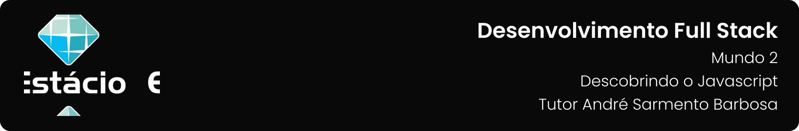

---

[Projeto](#-projeto) • [Como baixar e executar](#-como-baixar-e-executar) • [Procedimentos](#-procedimentos) • [Tecnologias utilizadas](#-tecnologias-utilizadas) • [Autor](#-autor) • [Licença](#-licença)

---

## 📋 Projeto

Missão Prática com o objetivo de fornecer exemplos de diferentes formas de utilização do JavaScript no lado cliente, uso de JSON na transmissão de dados e framework Vue.js apresentada no **`Nível 2: Descobrindo o Javascript`** do **`Mundo 2`** do curso de **`Desenvolvimento Full Stack`** da **`Estácio`**, do semestre de **`2023.2`**, sob a tutoria de André Sarmento Barbosa.

Projeto elaborado de acordo com as diretrizes especificadas para a Missão Prática, que podem ser conferidas [**`clicando aqui`**](https://sway.office.com/s/yMbDeDaSFmQFc6U1/embed).

## 📥 Como baixar e executar

Para baixar os arquivos deste repositório, você deve ter o [GitHub](https://github.com/) instalado em seu dispositivo.

Após instalado, você deverá acessar a guia `Arquivo` → `Clonar repositório` → `URL` e incluir o caminho `guedesert/meu-primeiro-site-cringe`.

Além disso, é interessante que você tenha um bom editor para trabalhar com os códigos, dos quais eu recomendo o uso do, [Visual Studio Code](https://code.visualstudio.com/).

## 🔗 Procedimentos

Durante o projeto foram desenvolvidos 03 procedimentos descritos abaixo:

<table>
  <tr>
    <th>Procedimento</th>
    <th>Descrição</th>
  </tr>
  <tr>
    <td>Ordenando com JavaScript e DOM <a href="https://guedesert.github.io/descobrindo-o-javascript/Ordenando%20com%20JavaScript%20e%20DOM/ordenando.html" target="_blank">↗️</a></td>
    <td>
       Envolve a criação de um projeto em JavaScript usando o Visual Studio Code. Ele inclui a implementação de funções de ordenação, como Bubble Sort, Selection Sort e Quick Sort. Além disso, é criada uma página HTML que permite adicionar valores a uma lista, ordená-la e misturá-la, com os resultados sendo exibidos no navegador.
    </td>
  </tr>
  <tr>
    <td>Página de Receitas Dinâmica <a href="https://guedesert.github.io/descobrindo-o-javascript/P%C3%A1gina%20de%20Receitas%20Din%C3%A2mica/receitas.html" target="_blank">↗️</a></td>
    <td>
    Consiste em criar uma página web para exibir receitas com imagem. É utilizado o framework Bootstrap para criar uma estrutura básica da página, e os dados das receitas são organizados em um vetor JSON. Funções são implementadas para formatar a lista de ingredientes e gerar os painéis de receitas, que são exibidos na página.
    </td>
  </tr>
  <tr>
    <td>Transmissão de Dados e Vue.js <a href="https://guedesert.github.io/descobrindo-o-javascript/Transmiss%C3%A3o%20de%20Dados%20e%20Vue.js/usuarios.html" target="_blank">↗️</a></td>
    <td>
      Envolve a criação de uma página web para exibir dados de usuários obtidos de um teste REST. É utilizada a biblioteca Vue.js para facilitar a manipulação dos dados. A página é estruturada usando o framework Bootstrap e os dados dos usuários são exibidos em painéis individuais usando a diretiva v-for do Vue.js. Isso permite que os dados sejam exibidos de forma dinâmica e reativa na página.
    </td>
  </tr>
</table>

## 🛠 Tecnologias utilizadas

Para a construção e execução do projeto foram utilizadas as seguintes tecnologias:

 

 

## 👥 Autor

| Aluno                                                  | Matrícula    | E-mail                                          |
| ------------------------------------------------------ | ------------ | ----------------------------------------------- |
| [Emanuel Roseira Guedes](https://github.com/guedesert) | 202212181407 | [📧](mailto:202212181407@alunos.estacio.br) |

## 📃 Licença

Este repositório está licensiado sob a [Licença MIT](./LICENSE).

